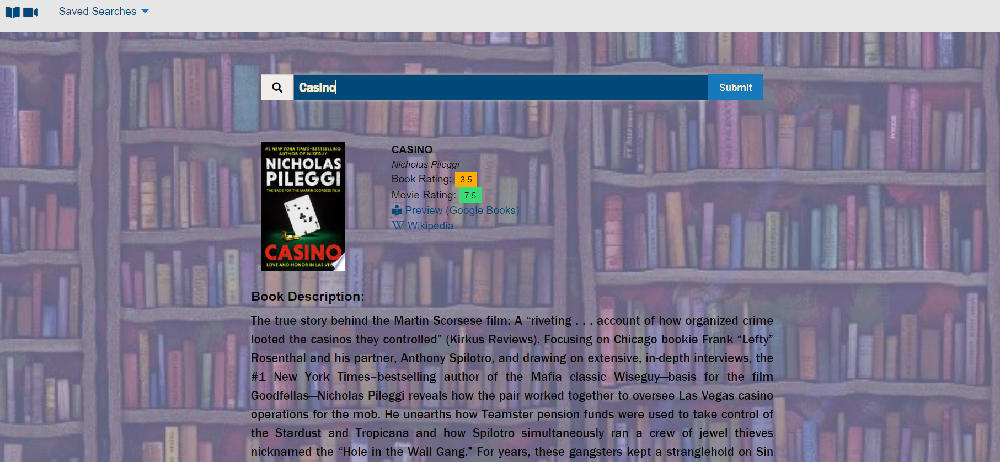

# Have You Read It?

 

## Developed by: ##
* [Andrea Ballew](https://github.com/andytheelf)
* [DeAnna Martinez](https://github.com/deannapi) 
* [Joseph DeWoody](https://github.com/jpd61)

**[Deployed Application](https://ut-project-1-group-5.github.io/project-1-group-5/)**

For this project we chose [Foundation](https://get.foundation/) as our CSS of choice.

The application is an interactive search query for book title that returns to the user results pertaining the book (and applicable movie version) from three different server-side APIs:
* [Google Books API](https://developers.google.com/books)
* [Movie Database API](https://developers.themoviedb.org/3)
* [Taste Dive API](https://tastedive.com/read/api)

The site employs client side storage to populate saved searches so that the user can easily recall what they have searched for prior.

The site is responsive and changes based upon the size of the window viewing it.

It has a polished UI.

It has a clean repository that meets quality coding standards (file structure, naming conventions, follows best practices for class/id naming conventions, indentation, quality comments, etc.). Favicons are required to be in root folder per favicon documentation [Favicon Generator](https://realfavicongenerator.net/)

Has a quality README (with unique name, description, technologies used, screenshot, and link to deployed application).

## The developers portfolio sites are: ##
* [Joseph DeWoody](https://jpd61.github.io/)
* [DeAnna Martinez](https://deannapi.github.io/portfolio/)
* [Andrea Ballew](https://andytheelf.github.io/)
